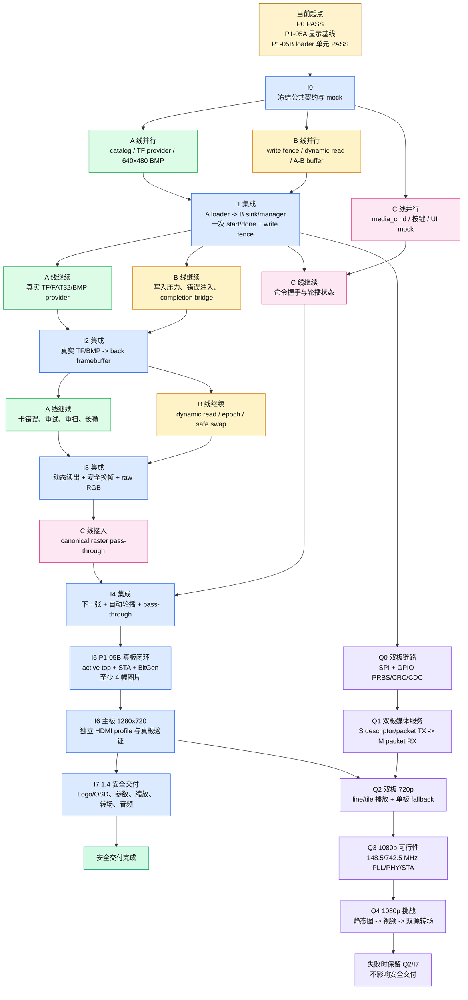

# 三线集成路线图

> 本文件是执行顺序图。A/B/C 的接口细节、文件所有权和单线验收分别见 `docs/05_line_A_media_plan.md`、`docs/06_line_B_framebuffer_plan.md`、`docs/07_line_C_presentation_plan.md`；实际证据等级以 `docs/03_plan_and_status.md` 为准。
>
> 双板迭代版：A/B/C 仍保持三线并行，但部署对象明确为主板 M 和从板 S。M 是唯一 HDMI 输出和最终 raster owner；S 是媒体生产 owner。双板链路和 1080p 不能破坏单板 rollback，也不能成为 720p + 1.4 安全交付线的前置依赖。

## 1. 当前起点

| 已完成模块/链路 | 当前证据 | 还不能说明 |
|---|---|---|
| P0 `fat32_file_reader -> bmp_parser/bmp_pixel_stream -> framebuffer_writer` | `[C] PASS(1698)` | 不能说明真实 TF 已接入 active top |
| P1-05A `pattern_writer -> SDRAM -> CDC/prefetch/line buffer -> HDMI_B` | `[C-sub]`、TD6.2.1 `[S]`；历史真板 `[B]` | TD6.2.1 bitstream 仍需重新上板复测 |
| P1-05B `p1_media_framebuffer_loader -> mock cached APUG011` | `[U] PASS(225)` | 不能说明 640×480、A/B 换帧或 TF→HDMI 已完成 |
| `frame_buffer_manager`、按键/应用、显示处理、音频单模块 | 各模块已有 RTL/TB | 尚未组成 P1-05B 系统闭环 |

当前架构只有一条运行时数据链：

```text
C 用户命令
    -> 集成 coordinator
    -> A TF/FAT32/BMP
    -> B back framebuffer / SDRAM
    -> B front framebuffer readout
    -> 集成 raster adapter
    -> C 表现层
    -> 冻结的 P1-04C/APUG092/HDMI
```

A 的 `p1_media_framebuffer_loader` 内部拥有唯一 `framebuffer_writer`。B 只拥有 front/back、SDRAM sink、读出和安全换帧；C 只产生用户命令和处理 RGB。任何阶段都不能增加第二个 writer、第二套 `done` 或第二套行帧 sideband。

双板目标链路为：

```text
S TF/FAT32/BMP/vseq -> S SDRAM -> packet TX
                                  -> M packet RX -> M line/tile buffer
M coordinator -> SPI control   -> M UI/OSD/transition/audio -> HDMI
```

SPI 是控制平面，source-synchronous GPIO 是候选数据平面；以太网不承担原始 1080p60 像素流。

## 2. 路线图总览

```text
I0 单板契约与 mock
  ↓
I1 单板 A loader + B sink 事务桥
  ↓
I2 单板真实 TF/BMP 写入
  ↓
I3 单板动态读出 + 安全换帧
  ↓
I4 单板 C pass-through + 基础轮播
  ↓
I5 单板 P1-05B 真板闭环
  ↓
I6 主板 1280×720 HDMI profile
  ↓
I7 主板 1.4 扩展完整交付

并行挑战支线：

Q0 双板 SPI/PRBS/CRC
  ↓
Q1 从板媒体服务 + 主板 packet RX
  ↓
Q2 双板 720p line/tile 播放
  ↓
Q3 1080p HDMI feasibility
  ↓
Q4 1080p 静态图/视频/双源转场
```

路线图中的“集成”都是一个明确的合并点；合并点通过后，后续工作才能建立在该结果上。I0～I7 是安全交付主线，Q0～Q4 是可回退的双板/1080p 挑战支线。

## 2.1 一页式执行路线图

下面的表只回答三个问题：先把什么接起来、通过后哪几条线继续并行、下一次集成的入口是什么。详细接口和验收条件仍看后面的 I0～I7。

| 节点 | 进入条件 | 本次集成动作 | 集成通过后，三线继续做什么 | 下一节点 |
|---|---|---|---|---|
| I0 单板契约（已冻结） | P0/P1 回归可运行 | 已冻结单板 `media_cmd`、`load_*`、`mem_wr_*`、地址布局和唯一 writer | A：catalog；B：fence/dynamic read；C：命令/UI mock | I1 |
| I1 单板写事务（当前 active） | I0 契约已冻结，loader + mock sink 可运行 | 接通 A loader -> B sink/manager，验证 fence 和一次性 start/done | A：640×480 provider；B：写入压力；C：握手 | I2 |
| I2 单板媒体写入 | I1 通过 | 接通真实 TF/FAT32/BMP -> back buffer，暂不接 UI 特效 | A：4 图和恢复；B：SDRAM 压测；C：下一张/轮播命令 | I3 |
| I3 单板读出换帧 | I2 写入稳定 | 接通 dynamic read、safe swap、raw/canonical raster | A：provider 长稳；B：epoch/underflow；C：pass-through | I4 |
| I4 单板基础交互 | I3 通过 | 接通 pass-through、下一张、自动轮播 | A/B：rollback/长稳；C：固定延迟 | I5 |
| I5 单板图片真板 | I4 RTL 通过 | active top + STA + BitGen + 4 图真板 | A/B：异常/资源；C：音频 adapter | I6 |
| I6 720p 输出 | I5 通过 | 独立完成 1280×720 HDMI profile 和主板输出 | A：媒体带宽；B：720p line/tile 预算；C：1.4 UI | I7 |
| I7 1.4 交付 | I6 通过 | 主板依次开启 Logo/OSD、参数、缩放、转场、音频可视化 | 三线围绕安全交付线做长稳和演示 | DONE |
| Q0 双板链路 | I1 通过即可并行 | M/S SPI 命令、GPIO PRBS、CRC、CDC、heartbeat | A：服务协议；B：TX/RX FIFO；C：命令映射 | Q1 |
| Q1 双板媒体服务 | Q0 通过 | S descriptor/packet TX 接 M packet RX，不接 HDMI | A：从板目录/预取；B：packet buffer/credit；C：状态 UI | Q2 |
| Q2 双板 720p | Q1 通过，I6 720p profile 绿色 | 主板显示从板 line/tile，保留单板 fallback | A：4 图/视频；B：持续带宽；C：双源转场接口 | Q3 |
| Q3 1080p feasibility | Q2 通过 | 独立验证 148.5/742.5 MHz HDMI PLL/PHY/STA | A/B：1080p packet/缓存预算；C：1080p UI 资源 | Q4 |
| Q4 1080p challenge | Q3 `[S]`/`[B]` 通过 | 接静态图，再接视频和双源转场 | 失败则回退 Q2，不能影响 DONE | — |

执行规则：I1 之前不接真实卡和 active top；I2 之前不讨论四图真板；I3 之前 C 只做命令和 pass-through；I5 之前不把任何模块单测或 BitGen 成功写成 P1-05B 完成。每个节点失败时回退到上一个绿色节点，再修复本节点，不跨节点堆叠问题。

**当前状态：** I0 的公共契约已于 2026-09-25 冻结，C 线 `media_command_controller` 取得 `[U] PASS(52)`；当前 TD6.2.1 implementation/BitGen 无 error，P1-05A active top 的 SWNS 为 `+0.599 ns`、HWNS 为 `+0.003 ns`。这不是 I0 的系统 `[C]`，因为 coordinator -> loader -> manager -> swap 尚未完成端到端验证。I1 是当前执行节点；其端到端 PASS 和 Q0 双板链路均未取得，Q0 仍须在 I1 通过后才可并行启动。

## 2.2 从当前阶段开始的开发流程图

下面这张图只描述执行顺序：A/B/C 在 I0 后并行推进，在明确的 I1～I5 节点汇合形成 P1-05B；I5 之后进入 1280×720 和 1.4 安全交付线。双板 Q 支线在 I1 通过后可以并行启动，但不阻塞 I7。



图中实线表示进入下一集成节点的必要依赖；Q 支线从 I1 后分叉，只有 Q2 需要等待 I6 的 1280×720 profile。Q4 失败时保留 Q2/I7，不回退或阻塞安全交付主线。

## 3. 逐步执行路线

### I0：冻结契约，建立可运行的替身（已冻结）

**已具备：** P0 媒体格式、P1-05A 显示基线、P1-05B loader 单元测试。

**本次完成：**

```text
C media_cmd
  -> coordinator mock
  -> A loader mock
  -> B manager/mock sink
  -> fake writer_done/ok
```

冻结 640×480、24-bit BI_RGB、`0x00RRGGBB`、A/B 地址、`mem_wr_valid/ready`、`load_start/ready/done/ok`、`frame_boundary` 和 raw/canonical video stream 的定义。把 manager 的历史 `writer_start` 标为遗留端口，不能连接第二个 writer。

**并行开发：**

- A：整理目录表和 TF provider 的输入/输出契约；
- B：实现 manager completion bridge、写入 fence 的 mock 和动态读出接口草案；
- C：实现 `media_cmd`、按键事件、固定周期轮播的 mock；
- 集成：维护 coordinator、fake sink、golden raster adapter 的公共 harness。

**通过条件：** 单条 mock 链能完成一次 `start -> mem_wr -> done -> pending_swap -> frame_boundary -> swap`，且一次命令只有一次 start/done。通过后进入 I1。

**2026-09-25 冻结记录：** `media_cmd`、唯一 writer、`load_*`、`mem_wr_*`、write fence、`writer_done/writer_ok` 与 swap 的所有权不再由单线 PR 改写。C 线 `media_command_controller` 已取得 QuestaSim 10.7c `[U] PASS(52)`，其 command payload 在 `ready=0` 时稳定，后续选图请求以 deferred command 合并。C0 关联回归通过；当前 P1-05A active top 的 TD6.2.1 实现与 BitGen 无 error，STA 为 SWNS `+0.599 ns`、STNS `0 ns`、HWNS `+0.003 ns`、HTNS `0 ns`。

上述证据冻结的是 I0 契约和单元边界，不等同于完整 mock 链的系统 `[C]`。`media_command_controller` 未收录到当前 active top source list，TD 报告也不能作为该模块的综合证据。I1 用 A loader -> B sink/manager 的事务桥取得 `start -> mem_wr -> done -> fence -> pending_swap` 端到端证据后，才能把该缺口关闭。

### I1：先把已实现的 A loader 接到 B manager（当前 active）

**已具备：** I0 契约冻结；A 的 `p1_media_framebuffer_loader` `[U] PASS(225)`；B 的 `frame_buffer_manager` 单元能力；B 的 SDRAM abstract sink；C 的 `media_command_controller` `[U] PASS(52)`。

**本次集成：**

```text
A p1_media_framebuffer_loader.mem_wr_*
    -> B write sink/mock SDRAM
A loader.done/ok + write_fence
    -> B manager.writer_done/writer_ok
    -> pending_swap
```

此阶段使用 mock sector provider 和 mock/fixed readout，不接 active top，不接 C 特效。

**并行开发：**

- A：把 loader 的 17×12 provider-realistic 测试扩展为固定 640×480 事务，保留 backpressure 和错误注入；
- B：完成 write sink、completion bridge、write fence 和重复 start/done 断言；
- C：完成 `media_cmd` 到 coordinator 的命令握手，但仍使用 fake display result；

**通过条件：** 写入完成必须经过 fence 才能进入 `pending_swap`；失败帧不污染 front；不出现双 writer。通过后，A/B 可以继续真实 TF 和动态读出，C 可以独立继续基础交互。

### I2：把真实 TF 目录和媒体 provider 接入 A/B 写入链

**已具备：** I1 的 A loader + B sink 事务桥。

**本次集成：**

```text
TF/SPI provider
  -> FAT32 mount/catalog
  -> image_id 查表
  -> A p1_media_framebuffer_loader
  -> B back buffer write
```

A 需要补齐真实卡初始化、目录扫描和 catalog。当前 `fat32_scan` 只覆盖根目录第一簇第一扇区，因此 I2 的首版卡镜像必须明确放置至少 4 个可识别 8.3 BMP 项，并对坏项、删除项和非 BMP 项做筛选。

**并行开发：**

- A：真实 TF provider、目录表、至少 4 个图片的 metadata 和 640×480 BMP 装载；
- B：用真实写流压测 read-priority、writer FIFO、SDRAM refresh 和写入 fence；
- C：完成两个按键语义：下一张、启停自动轮播，并输出 `media_cmd`，不直接触发 loader；

**通过条件：** 不少于 4 幅图片可被自动发现；逐幅写入 back buffer 的 RGB golden 正确；坏文件不产生 `load_ok`；C 命令在 busy 时有明确暂存或拒绝结果。通过后进入 I3。

### I3：把 B 的动态读出和安全换帧接入 A/B 子链

**已具备：** I2 的真实 A→B 写入链；P1-05A 固定 pattern 读出链。

**本次集成：**

```text
B manager.read_base/read_geometry
  -> dynamic read wrapper
  -> 已验证 CDC/prefetch/line buffer
  -> B raw RGB stream
```

必须处理 `p1_sdram_hdmi_pipeline` 当前 `FRAME_BASE=0` 固定参数、旧行预取、outstanding response、line buffer 失效和新 descriptor 的原子提交。不能只替换一个 base 信号。

**并行开发：**

- A：继续完善卡错误、重试、重扫和 provider timeout；
- B：完成 dynamic read、epoch、safe swap、旧 front 释放和 `underflow/protocol_error` 诊断；
- C：完成 canonical raster pass-through wrapper，固定 RGB 处理延迟；

**通过条件：** A/B/A 图片循环写入和显示稳定；swap 只发生在安全 frame boundary；一帧内 read base/geometry 不变；旧 front 未释放前不能再次写入；raw RGB 与 raster sideband 对齐。通过后进入 I4。

### I4：先接 C 的旁路和基础交互

**已具备：** I3 的真实 A/B raw RGB stream 和 canonical raster adapter；C 的 `media_cmd`、按键和应用状态。

**本次集成：**

```text
B raw RGB
  -> golden-raster adapter
  -> C pass-through
  -> 冻结 HDMI cadence
C next/play-pause
  -> media_cmd
  -> coordinator
```

此阶段只接 pass-through、下一张、启停轮播和可配置周期。`enhance`、`scaler`、`transition`、OSD 和音频全部保持 bypass。

**通过条件：** 至少两键行为正确；手动下一张和自动轮播都只在安全换帧后生效；无撕裂、无持续 underflow、无半帧参数混合。通过后进入 I5。

### I5：P1-05B 图片 active top 与真板闭环

**已具备：** I4 的 A/B/C RTL 子链和 P1-05A rollback。

**本次集成：** 集成负责人唯一修改 active top、工程和约束：

1. 先下载并复测 P1-05A TD6.2.1 bitstream；
2. 再接真实 TF/A loader、B dynamic read、C pass-through；
3. 保留固定 pattern fallback 和 HDMI rollback；
4. 重新执行 `read_design -> synthesis -> placement -> routing -> final STA -> BitGen`；
5. 真板验证至少 4 幅图片、手动切图、自动轮播、无明显撕裂和异常恢复。

**通过条件：** P1-05B 图片基础闭环取得新的 `[C]`、`[S]`、`[B]` 证据。此时仍不能把 HDMI 音频写成已完成。

### I6：主板 1280×720 输出 profile

**已具备：** I5 的真实图片播放；P1-04C HDMI baseline；C 的显示和音频单模块结果。

**本次集成：**

```text
M 1280×720 timing/profile
  -> APUG092/PHY feasibility
  -> line/tile display path
  -> HDMI video rollback
```

I6 只建立主板 1280×720 输出 profile；不把 1080p 作为 I6 的隐含结果。任何 profile 变更都必须单独重新实现、STA、BitGen 和真板验证。

**通过条件：** 1280×720 图像稳定输出，P1-05A rollback 可构建，重新完成 STA、BitGen 和真板验证。I6 通过后进入 1.4 安全交付线。

### I7：1.4 扩展完整交付

扩展按一次只开一个功能的顺序推进：

```text
Logo/OSD/字幕
  -> 亮度对比度和实时参数
  -> 自适应缩放
  -> 淡入淡出或擦拭
  -> HDMI 音频与音频可视化
  -> 启动、资源、鲁棒性优化
```

每个扩展都有独立 mock、Questa、综合和 rollback；不回改 P1-05A HDMI low-level，不把扩展依赖倒灌成 A/B/C 或 M/S 的循环依赖。

## 4. 三线并行安排

| 当前集成点 | A 线下一项 | B 线下一项 | C 线下一项 | 下一集成点 |
|---|---|---|---|---|
| I0 mock 契约 | catalog/provider 接口 | fence/dynamic-read 接口 | media_cmd/按键 mock | I1 |
| I1 A loader + B sink | 640×480 provider-realistic | write fence + 压测 | 命令握手 | I2 |
| I2 真实 A/B 写入 | 真实 TF、4 图、错误恢复 | 边读边写预算 | 两键轮播、周期配置 | I3 |
| I3 B raw readout | provider robustness | safe swap/epoch | canonical pass-through | I4 |
| I4 C pass-through | 卡与目录长稳 | P1-05A rollback/STA准备 | 基础交互回归 | I5 |
| I5 图片真板 | 图片长稳/异常恢复 | 资源和时序复核 | PCM/audio adapter | I6 |
| I6 720p 输出 | 从板媒体带宽 | 主板 line/tile 预算 | Logo/OSD/参数 | I7 |
| I7 1.4 交付 | 媒体长稳 | HDMI/audio 长稳 | 缩放/转场/音频可视化 | DONE |
| Q0 双板链路 | descriptor/packet 契约 | PRBS/CRC/CDC | SPI 命令映射 | Q1 |
| Q1 双板媒体服务 | 从板目录/预取 | packet buffer/credit | 状态 UI | Q2 |
| Q2 双板 720p | 4 图/视频 | 持续吞吐 | 双源转场接口 | Q3 |
| Q3 1080p feasibility | 1080p packet | 1080p 缓存 | 1080p UI 资源 | Q4 |

关键原则是：每次集成只合并已经通过当前门禁的模块；集成完成后，下一批模块才以该结果为新基线继续开发。这样 A 不需要等待 C 的特效，C 不需要等待真实 TF 才能做交互，B 也不需要重新实现 A 的 writer。

## 5. 合并与回退规则

推荐合并顺序：

```text
I0/I1 single-board contract/transaction
 -> I2/I3 media write/dynamic-read
 -> I4/I5 basic interaction/image board
 -> I6 1280×720 output
 -> I7 1.4 complete delivery
 ||
 Q0 SPI/PRBS/CRC
 -> Q1 packet service
 -> Q2 dual-board 720p
 -> Q3 1080p feasibility
 -> Q4 1080p challenge
```

每次只合并一个集成候选；失败时回退到上一个绿色路线节点。P1-05A fixed-pattern rollback 必须始终可构建。任何 active-netlist 变更都必须重新执行完整 STA；当前 P1-05A 的 HWNS 只有 `+0.003 ns`，不能继承为后续设计的时序裕量。

## 6. 完成定义

### P1-05B 图片闭环

- 自动发现并装载至少 4 幅 640×480、24-bit BMP；
- A/B framebuffer、write fence、safe swap 和动态读出通过；
- 下一张、启停自动轮播和可配置周期通过；
- HDMI 显示连续、清晰，无明显花屏、持续 underflow 或撕裂；
- 当前工具链的 STA、BitGen 和真板证据齐全。

### 竞赛基础闭环

除上述图片闭环外，还必须有 I7 的图像同时 HDMI 音频真板证据。`tone_gen` 或 `hdmi_audio_pack` 单测、BitGen 成功和 OSD 演示不能替代音频板级验收。

### 1.4 安全交付闭环

- I6 取得 1280×720 主板视频 `[C]`、`[S]`、`[B]` 证据；
- I7 取得图层/字幕、转场、自适应缩放、实时参数/OSD、音频可视化证据；
- HDMI 音频同时取得 APUG092/Data Island 和真板证据；
- 双板 Q 支线未通过时，I7 仍可使用单板媒体或固定测试源完成演示。

### 双板与 1080p 挑战闭环

- Q0/Q1 取得 SPI 控制和 source-synchronous 数据面的 CRC/持续吞吐证据；
- Q2 取得双板 720p line/tile 播放 `[C]`、`[S]`、`[B]`；
- Q3 取得主板 1920×1080 HDMI profile 的 `[S]`，并完成真板可观察性门禁；
- Q4 先完成静态图片，再尝试视频和双源转场；失败回退 Q2，不影响 I7 安全交付。
