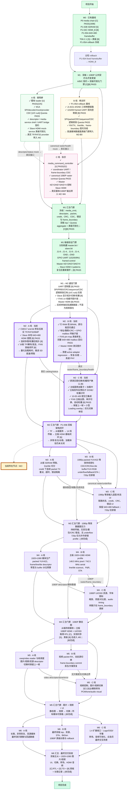

# 三线统一集成流程图

开发只使用一套节点 `M0～M6`。每个节点先分成 A/B/C 三条任务，再在同一个节点汇合。`M1` 已完成 deterministic 双板可视化控制门禁，当前节点为 `M2`。**FIX6 已取得 TF → Slave → 14 线 → Master HDMI 的真实图片真板 PASS，NEXT/PREV 与自动轮播也已通过；M2 继续处理加载体验、异常恢复和回归债务。状态以 `docs/03_plan_and_status.md` 为准。**

图例：绿色 = 已完成；黄色 = 当前节点/当前任务；白色 = 未完成；蓝色 = 三线汇合；紫色 = 双板 + 1080P 主线；A/B/C 使用不同边框颜色；实线 = 必须完成的真实依赖；点划线 = 可先用 mock、随后必须替换为真实接口的依赖；虚线 = rollback/fallback。C 线的 A/B 依赖专门画在每个节点旁，避免把“可独立写代码”误读成“可以脱离 A/B 完成验收”。

工程入口同时冻结为两份长期 TD6.2.1 工程：`FPGA_Competition_HDMI_MASTER.al` 与 `FPGA_Competition_HDMI_SLAVE.al`。两者共享根目录 `src/`，分别使用 `constraints/master/` 与 `constraints/slave/`。从 M2 到 M6 只演进这两份工程，不新增阶段性 active `.al`。


```mermaid
flowchart TD
    START["项目开始"] --> M0["M0 · 已有基线<br/>P0 media chain [C] PASS(1698)<br/>P1-02B SDRAM [S]<br/>P1-04C HDMI_B [B]<br/>P1-05A 640×480 framebuffer<br/>TD6.2.1 [S] + 真板 [B]<br/>P1-05A rollback 冻结"]

    M0 --> M1G["M1 · 双板 + 1080P 公共契约与开发骨架<br/>A/B/C 契约 + 双板可视化门禁 [C][B] PASS"]
    M2E -.-> CUR["当前所在节点：M2↑"]
    M1G --> M1A["A 线 · 曾雨婷<br/>✓ 既有 loader [U] PASS(225)<br/>✓ M1A SPI/decoder/mock/provider CDC [U/C-sub] Questa PASS<br/>✓ descriptor / media-service shell / UART bridge 契约<br/>✓ Slave HDMI mock-service 真板可视化<br/>→ 真实 TF/FAT32 provider 转入 M2"]
    M1G --> M1B["B 线 · 杨文轩<br/>✓ P1-05A rollback 基线<br/>✓ J1-8/J1-4/GND 三线物理链路<br/>✓ 115200 framed UART 双向控制链 [B] PASS<br/>✓ SPI/packet/CRC/sequence/CDC 逻辑骨架 Questa PASS<br/>✓ RX/TX、line/tile、frame-boundary 契约冻结<br/>→ 高速媒体数据面真板门禁转入 M2-B0"]
    M1G --> M1C["C 线 · 张宗<br/>✓ media_command_controller [U] PASS(52)<br/>✓ coordinator UART / frame-boundary CDC<br/>✓ canonical 1080P raster contract Questa PASS<br/>✓ Master KEY2/KEY3/KEY4 控制 Slave HDMI<br/>→ 真实媒体/1080P 输出转入 M2~M4"]
    M1A -.->|descriptor/status mock → 真实接口| M1C
    M1B -.->|canonical raster/health mock → 真实接口| M1C
    M1A --> M1E["M1 汇合门禁<br/>冻结：media_cmd、descriptor、packet、credit、CRC、CDC、错误与 frame_boundary<br/>双板 top + Questa aggregate + 真板可视化；[C][B] PASS"]
    M1B --> M1E
    M1C --> M1E

    M1E --> V1["M1 板级验证门禁<br/>分别构建 master.bit / slave.bit<br/>J1-8→J1-4、J1-8←J1-4、GND↔GND<br/>GPIO UART 115200/8N1 framed control<br/>Master KEY2/KEY3/KEY4 → Slave HDMI 4 patterns<br/>复位后重新握手；[B] PASS"]
    V1 --> V2["M1→M2 通信门禁<br/>UART 控制面 [B] PASS<br/>SPI/PRBS/CRC/sequence/CDC 逻辑骨架已有 [U/C-sub] 仿真<br/>✓ Slave 显示拓扑切换/轮播 [B]<br/>✓ FIX6 14 线握手图片链 → Master HDMI [B] PASS<br/>→ 后续单独验高速数据面；不混为视频吞吐"]
    V2 --> M2A["M2 · A 线 · 当前<br/>✓ CMD17 end-bit 修复后真实 TF/FAT32/BMP<br/>✓ Slave 本地 640×480 HDMI 首图 [B] PASS<br/>✓ 连续多图/轮播旧拓扑 [B]<br/>✓ 从板 TF/解码/发送，FIX6 真板闭环 [B]<br/>→ 量化加载耗时，推进 SD 提速/预取"]
    V2 --> M2B["M2 · B 线 · 当前<br/>✓ 行 RAM 改 BRAM，原功能回归通过<br/>✓ 地址/像素/CRC + GPIO mailbox 传输子链<br/>✓ FIX6 pin-map 真板修复，完整 640×480 mailbox 回归 PASS<br/>✓ Master HDMI 真实图片 [B]<br/>→ 清理 active adapter regression → 恢复/长稳 → 高速 PHY"]
    V2 --> M2C["M2 · C 线 · 当前<br/>✓ 原真实图切换/轮播用户确认 [B]<br/>✓ 主板圆角加载卡 + 加载中<br/>✓ 主板发布反馈后才 DONE/轮播计时<br/>✓ 10-05 A/B 提交已集成<br/>✓ FIX6 主板出图、单步切换、自动轮播 [B] PASS<br/>→ 保留上一帧 + 小型 Loading overlay；优化切换体验"]
    M2A --> M2E["M2 汇合门禁 · P1-05B 双板架构闭环<br/>✓ TF → 从板服务 → 14 线传输 → 主板 HDMI 基础闭环 [B]<br/>→ 异常/复位/长稳、加载体验仍未关闭"]
    M2B --> M2E
    M2C --> M2E
    M2A -->|真实 catalog/status| M2C
    M2B -->|真实 raster/frame_boundary/health| M2C

    M2E --> M3A["M3 · A 线<br/>从板 SDRAM 预取、line/tile 切分<br/>credit 下连续 packet TX<br/>重试、超时、错误隔离"]
    M2E --> M3B["M3 · B 线<br/>1080p packed-YUV422 等效持续吞吐<br/>CDC/CRC/line-tile buffer/YUV-RGB<br/>underflow/fallback/STA；720p 仅排错"]
    M2E --> M3C["M3 · C 线<br/>1080p 等效输入适配/状态 UI<br/>链路状态、credit、CRC、错误 UI<br/>保留 640×480 fallback；720p 仅排错"]
    M3A --> M3E["M3 汇合门禁 · 1080p 等效数据面压力<br/>持续传输、无丢包/重包/CRC 错误、无 underflow<br/>720p 仅允许作排错 profile；[未完成]"]
    M3B --> M3E
    M3C --> M3E
    M3A -->|媒体类型/帧数/完成状态| M3C
    M3B -->|canonical raster/underflow| M3C

    M3E --> M4A["M4 · A 线<br/>1920×1080 媒体生产<br/>packed YUV422、frame/line/tile descriptor<br/>带宽与 buffer 水位预算"]
    M3E --> M4B["M4 · B 线<br/>主板 1920×1080 HDMI profile<br/>148.5 MHz pixel / 742.5 MHz serial<br/>line/tile scanout、P&R、STA"]
    M3E --> M4C["M4 · C 线<br/>1080P UI/OSD 资源、字体图标<br/>缩放、亮度/对比度、audio timing<br/>参数只在 frame_boundary 更新"]
    M4A --> M4E["M4 汇合门禁 · 1080P 静态图<br/>从板持续媒体 + 主板 1080P HDMI + UI/OSD<br/>取得 RTL [C]、实现时序 [S]、真板 [B] 后进入 M5；[未完成]"]
    M4B --> M4E
    M4C --> M4E
    M4A -->|1080P descriptor/媒体数据| M4C
    M4B -->|1080P raster/frame_boundary| M4C

    M4E --> M5A["M5 · A 线<br/>vseq/video reader 与帧调度<br/>图片/视频/双源 descriptor<br/>切换时保留上一帧"]
    M4E --> M5B["M5 · B 线<br/>视频 packet RX、动态源切换<br/>frame-boundary commit<br/>丢包/欠载恢复"]
    M4E --> M5C["M5 · C 线<br/>视频控制、图片/视频切换<br/>淡入淡出/擦除转场<br/>PCM/tone/audio visual"]
    M5A --> M5E["M5 汇合门禁 · 图片 + 视频 + UI<br/>静态图 → 视频 → 切换；所有模块可旁路；[未完成]"]
    M5B --> M5E
    M5C --> M5E
    M5A -->|video descriptor/done/error| M5C
    M5B -->|无欠载提交/切换边界| M5C

    M5E --> M6A["M6 · A 线<br/>长稳、异常恢复、双源媒体<br/>最终演示镜像与回退数据"]
    M5E --> M6B["M6 · B 线<br/>最终双板 top、资源、STA、BitGen<br/>1080P 真板长稳与 rollback"]
    M5E --> M6C["M6 · C 线<br/>1.4 扩展收口：Logo/OSD/字幕<br/>转场、音频可视化、应急页<br/>最终交互场景"]
    M6A --> M6E["M6 汇合 · 最终交付验收<br/>双板主从 + 1920×1080 图片/视频<br/>UI、切换、转场、HDMI 音频<br/>[C] RTL + [S] TD + [B] 真板 + 长稳记录；[未完成]"]
    M6B --> M6E
    M6C --> M6E
    M6E --> DONE["项目完成"]

    M0 -.-> RB["全程 rollback<br/>P1-05A fixed framebuffer → HDMI_B"]
    RB -.-> M1G

    classDef done fill:#dcfce7,stroke:#16a34a,color:#111;
    classDef current fill:#fff3cd,stroke:#b45309,color:#111,stroke-width:4px;
    classDef pending fill:#ffffff,stroke:#6b7280,color:#111;
    classDef merge fill:#dbeafe,stroke:#2563eb,color:#111;
    classDef laneA fill:#f0fdf4,stroke:#16a34a,color:#111;
    classDef laneB fill:#fffbeb,stroke:#d97706,color:#111;
    classDef laneC fill:#fdf2f8,stroke:#db2777,color:#111;
    classDef mainline fill:#ede9fe,stroke:#7c3aed,color:#111;
    classDef endpoint fill:#d1fae5,stroke:#059669,color:#111;

    class START,M0,M1G,M1A,M1B,M1C,M1E,V1 done;
    class M2A,M2B,M2C,M2E,CUR current;
    class V2,M3A,M3B,M3C,M4A,M4B,M4C,M5A,M5B,M5C,M6A,M6B,M6C pending;
    class M2E,M3E,M4E,M5E,M6E merge;
    class M1A,M2A,M3A,M4A,M5A,M6A laneA;
    class M1B,M2B,M3B,M4B,M5B,M6B laneB;
    class M1C,M2C,M3C,M4C,M5C,M6C laneC;
    class M2A,M2B,M2C,M2E,M3A,M3B,M3C,M3E,M4A,M4B,M4C,M4E,M5A,M5B,M5C,M5E,M6A,M6B,M6C,M6E mainline;
    class DONE endpoint;
```


## 节点验证纪律（2026-10-01 起强制执行）

每个 M 节点均按以下顺序推进，任何一步失败都回到该层定位，不直接跨层修改其它模块：

```text
A/B/C 单元与子链 Questa
        ↓
Master-alone：独立 TD synthesis / P&R / STA / BitGen / 板级状态
        ↓
Slave-alone：独立 TD synthesis / P&R / STA / BitGen / HDMI 或本地自检
        ↓
Dual-control：只接控制面，验证命令/状态/复位恢复
        ↓
Dual-data：再接媒体数据面，验证 CRC/sequence/credit/CDC/underflow
        ↓
节点汇合门禁：功能 + 时序 + 真板 + 回退路径
```

当前 M1 已按此方法完成控制面与可视化真板闭环：Master 的 KEY2/KEY3/KEY4 可通过 115200 framed UART 控制 Slave HDMI 的 4 个 deterministic pattern；Questa aggregate 回归也已通过。M2 从真实 TF/FAT32/BMP 与高速媒体数据面开始，最终 HDMI owner 按 `01_architecture.md` 回归 Master。

2026-10-05：`M2_FIX6_BOARD_PASS_20261005` 已完成主板 HDMI 的真实图片双板闭环，NEXT/PREV 与自动轮播真板通过。当前优先事项变为：加载耗时优化、保留上一帧的小型 Loading overlay、异常/复位长稳，以及 current active regression 清理。14 线图片链不替代后续持续视频带宽门禁。

> 开发过程、验证记录、日志和截图不得直接新增到 `docs/` 根目录；统一放入 `docs/develop_records/`，其中原始证据放 `docs/develop_records/evidence/`。`docs/` 根目录只保留 01～08 的规范文档。
## 2026-10-03 M2-A board gate update

真实 TF 卡已经在 Slave 单板完成 `TF -> FAT32 -> 640×480 BMP -> internal SDRAM -> HDMI` 真板显示：烧录/复位后先黄色加载页，随后出现真实图片。无卡复位为红色错误页，插卡后复位可恢复。CMD17 end-bit `0x00 -> 0x01` 修复后首次取得该结果。

此为历史阶段记录，后续 Dual-control 已通过，当前下一步见图。该阶段使用 M1 已真板验证的三线 UART（TX/RX/GND），Master 消费真实 `catalog_count` 并发送 `OPEN(image_id)`；Slave HDMI 暂时保留为可视输出。此门禁通过后才进入 M2-B source-synchronous 媒体数据面，不能把“Master 控制 Slave 本地 HDMI”写成完整 M2 双板媒体闭环。


> 2026-10-05 当前冻结基线为 `M2_FIX6_BOARD_PASS_20261005`：FIX6 修正 J1/FPGA 球位映射后，主板真实图片显示、切换与轮播 `[B] PASS`。冻结记录见 [M2_FIX6_BOARD_PASS_FREEZE_20261005](develop_records/M2_FIX6_BOARD_PASS_FREEZE_20261005.md)，状态以 03 为准。
