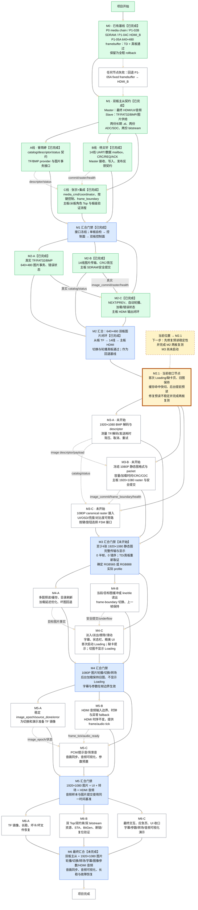

# 三线图片主线集成路线图

> 本图是从当前仓库状态到最终交付的唯一开发路线图。三个人始终分别负责 A/B/C；张宗同时负责集成。没有 I 线、Q 线，也没有“先做视频、最后再兼容图片”的第二条路线。绿色为已完成，黄色为当前节点，白色为未完成，蓝色为三线汇合；实线是必须的真实依赖，点划线是可以先用 mock、汇合时必须替换为真实接口的依赖。

```mermaid
flowchart TD
    START["项目开始"] --> M0["M0 · 已有基线【已完成】<br/>P0 media chain / P1-02B SDRAM / P1-04C HDMI_B<br/>P1-05A 640×480 framebuffer：TD + 真板通过<br/>保留为全程 rollback"]

    M0 --> M1["M1 · 双板主从契约【已完成】<br/>Master：最终 HDMI/UI/音频<br/>Slave：TF/FAT32/BMP/图片供给<br/>两份长期 .al、两份 ADC/SDC、两份 bitstream"]
    M1 --> M1A["A线 · 曾雨婷【已完成】<br/>catalog/descriptor/status 契约<br/>TF/BMP provider 与图片事务接口"]
    M1 --> M1B["B线 · 杨文轩【已完成】<br/>14线 UART/数据 mailbox、CRC/REQ/ACK<br/>Master 接收、写入、发布反馈契约"]
    M1 --> M1C["C线 · 张宗+集成【已完成】<br/>media_cmd/coordinator、按键控制、frame_boundary<br/>主板/从板角色 Top 与板级验证流程"]
    M1A -.->|descriptor/status| M1C
    M1B -.->|commit/raster/health| M1C
    M1A --> M1E["M1 汇合门禁【已完成】<br/>接口冻结；单板自检 → 控制面 → 双板控制面"]
    M1B --> M1E
    M1C --> M1E

    M1E --> M2A["M2-A【已完成】<br/>真实 TF/FAT32/BMP<br/>640×480 图片事务、错误状态"]
    M1E --> M2B["M2-B【已完成】<br/>14线图片传输、CRC/背压<br/>主板 SDRAM/安全提交"]
    M1E --> M2C["M2-C【已完成】<br/>NEXT/PREV、自动轮播、加载/错误状态<br/>主板 HDMI 输出闭环"]
    M2A --> M2E["M2 汇合：640×480 双板图片闭环【已完成】<br/>从板 TF → 14线 → 主板 HDMI<br/>切换与轮播真板通过；作为回退基线"]
    M2B --> M2E
    M2C --> M2E
    M2A -->|真实 catalog/status| M2C
    M2B -->|真实 image_commit/raster/health| M2C

    M2E --> M2F["M2.1 · 当前收口节点<br/>首次 Loading/缺卡页、旧图保持<br/>缓存命中快切、后台提前预读<br/>修复预读不稳定并完成两板复测"]
    M2F --> M3A["M3-A · 未开始<br/>1920×1080 BMP 解码与 descriptor<br/>测量 TF/解码/发送耗时<br/>背压、取消、重试"]
    M2F --> M3B["M3-B · 未开始<br/>冻结 1080P 静态图格式与 packet<br/>容量/加载时间/CRC/CDC<br/>主板 1920×1080 raster 与安全提交"]
    M2F --> M3C["M3-C · 未开始<br/>1080P canonical raster 接入<br/>UI/OSD/亮度/对比度可旁路<br/>按键/旋钮选择 FSM 接口"]
    M3A -.->|image descriptor/payload| M3B
    M3A -.->|catalog/status| M3C
    M3B -.->|image_commit/frame_boundary/health| M3C
    M3A --> M3E["M3 汇合门禁【未开始】<br/>至少4张 1920×1080 静态图完整传输与显示<br/>0 半帧、0 错序；TD/真板重新取证<br/>确定 RGB565 或 RGB888 实际 profile"]
    M3B --> M3E
    M3C --> M3E
    CUR["当前位置 → M2.1<br/>下一步：先修复预读稳定性并完成 M2 两板复测<br/>M3 尚未启动"] -.-> M2F

    M3E --> M4A["M4-A<br/>多图预读/缓存、目录刷新<br/>加载延迟优化、坏图回退"]
    M3E --> M4B["M4-B<br/>当前/目标图缓冲或 line/tile 读出<br/>frame-boundary 切换、上一帧保持"]
    M3E --> M4C["M4-C<br/>淡入/淡出/擦除/滑动<br/>字幕、状态栏、精美 UI<br/>首次启动 Loading；缺卡提示；切图不显示 Loading"]
    M4A -.->|目标图片事实| M4C
    M4B -.->|安全提交/underflow| M4C
    M4A --> M4E["M4 汇合门禁<br/>1080P 图片轮播/切换/转场<br/>后台加载保持旧图、不显示 Loading<br/>字幕与参数在帧边界生效"]
    M4B --> M4E
    M4C --> M4E

    M4E --> M5A["M5-A<br/>稳定 image_epoch/source_done/error<br/>为切换和演示准备 TF 镜像"]
    M4E --> M5B["M5-B<br/>HDMI 音频输入边界、时钟与异常 fallback<br/>HDMI 时序不变，提供 frame/audio tick"]
    M4E --> M5C["M5-C<br/>PCM/提示音/背景音<br/>音画同步、音频可视化、参数预置"]
    M5A -.->|image_epoch/状态| M5C
    M5B -.->|frame_tick/audio_ready| M5C
    M5A --> M5E["M5 汇合门禁<br/>1920×1080 图片 + UI + 转场 + HDMI 音频<br/>音频样本与图片提交使用同一时间基准"]
    M5B --> M5E
    M5C --> M5E

    M5E --> M6A["M6-A<br/>TF 镜像、长稳、坏卡/坏文件恢复"]
    M5E --> M6B["M6-B<br/>双 Top/双约束/双 bitstream<br/>资源、STA、BitGen、断链/复位验证"]
    M5E --> M6C["M6-C<br/>最终交互、应急页、UI 收口<br/>字幕/参数/转场/音频可视化演示"]
    M6A --> M6E["M6 最终汇合【未完成】<br/>双板主从 + 1920×1080 图片<br/>轮播/切换/转场/字幕/图像参数/HDMI 音频<br/>音画同步、音频可视化、长稳与故障恢复"]
    M6B --> M6E
    M6C --> M6E
    M6E --> DONE["项目完成"]

    M0 -.-> RB["任何节点失败：回退 P1-05A fixed framebuffer → HDMI_B"]
    RB -.-> M1

    classDef done fill:#dcfce7,stroke:#16a34a,color:#111;
    classDef current fill:#fff3cd,stroke:#b45309,color:#111,stroke-width:4px;
    classDef pending fill:#fff,stroke:#6b7280,color:#111;
    classDef merge fill:#dbeafe,stroke:#2563eb,color:#111;
    classDef marker fill:#fef3c7,stroke:#b45309,color:#111,stroke-dasharray:5 5;
    class START,M0,M1,M1A,M1B,M1C,M1E,M2A,M2B,M2C,M2E done;
    class M2F current;
    class M3A,M3B,M3C,M3E,M4A,M4B,M4C,M4E,M5A,M5B,M5C,M5E,M6A,M6B,M6C,M6E,DONE,RB pending;
    class CUR marker;
    class M1E,M2E,M3E,M4E,M5E,M6E merge;
```

## 节点验证顺序

每个节点固定执行：A/B/C 单元与子链 Questa → Master-alone → Slave-alone → 双板控制面 → 双板图片数据面 → TD synthesis/P&R/STA/BitGen → 真板汇合。某一层失败，只修该层所属模块并回到最近通过基线；不跨线偷偷改动。

## 关键依赖规则

- A 只返回目录、图片 descriptor、payload 和媒体事实；C 不等待 A 的 UI，A 不等待 C 的 UI。
- B 只返回 `image_commit/frame_boundary/health`；C 不驱动 B 的 framebuffer 地址或 swap。
- C 只发高层命令和配置；不直接读 TF、不解析 packet、不绕过 B 提交。
- 1080P 的像素格式、缓存方式和 packet 宽度在 M3-0 由 A/B/集成共同冻结；在此之前只允许 mock，不把候选带宽写成 PASS。
- 两个 active `.al` 工程始终分别生成 `master.bit` 和 `slave.bit`；每次 Top/约束变化都分别综合、布局布线、STA、BitGen。
