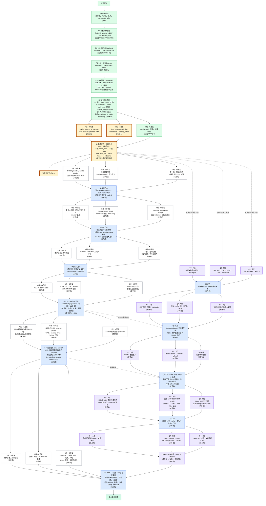

# 三线集成总流程图

除编号和图例外，开发顺序、A/B/C 三线任务、分叉点和汇合点全部放在下图中。主流程从项目开始到双板 1080p 主交付结束；I1～I5 先建立单板 P1-05B 基线，Q0～Q4 是其后的双板 + 1080p 必经主线。

图例：绿色 = 已完成；黄色 = 当前进行中；白色 = 未完成；蓝色 = 三线汇合集成；紫色 = 双板 + 1080p 主线；实线 = 必要依赖；虚线 = 主线允许的并行准备或回退。

```mermaid
flowchart TD
    START["项目开始"] --> P0A["P0 媒体模块<br/>文件流、FAT32、BMP、framebuffer_writer<br/>[完成]"]
    P0A --> P0B["P0 完整媒体主链<br/>fat32_file_reader → BMP → framebuffer_writer<br/>[完成] RTL [C] PASS(1698)"]
    P0B --> P1A["P1-02B SDRAM backend<br/>APUG011 / internal SDRAM<br/>[完成] 150 MHz [S]"]
    P1A --> P1B["P1-04C HDMI baseline<br/>APUG092 / PHY / reset / EDID<br/>[完成] 真板 [B]"]
    P1B --> P1C["P1-05A 固定 framebuffer<br/>SDRAM → CDC/prefetch → HDMI<br/>[完成] TD6.2.1 [S][B]<br/>bitstream 已上板显示正常"]

    P1C --> I0["I0 公共契约冻结<br/>A：唯一 writer owner [完成]<br/>B：front/back、fence、safe swap [完成]<br/>C：media_cmd_controller [U] PASS(52) [完成]<br/>系统 coordinator → loader → manager [C] [未完成]"]

    I0 --> A1["A线 · I1准备<br/>loader → mem_wr harness<br/>固定 640×480 provider 流程<br/>[未完成]"]
    I0 --> B1["B线 · I1准备<br/>sink、completion bridge<br/>write fence、pending_swap<br/>[未完成]"]
    I0 --> C1["C线 · I1准备<br/>media_cmd、按键、轮播 mock<br/>[完成] PASS(52)"]

    A1 --> M1["I1 集成汇合 · 当前节点<br/>A/B/C 合并检查：<br/>一次 media_cmd → 一次 start<br/>多笔 mem_wr → write fence → 一次 done<br/>[未完成] 单板写事务桥"]
    B1 --> M1
    C1 --> M1
    M1 --- CUR["当前所在节点 I1→"]

    M1 --> A2["A线 · I2开发<br/>TF/SPI provider、FAT32 catalog<br/>至少 4 幅 640×480 BMP<br/>[未完成]"]
    M1 --> B2["B线 · I2开发<br/>接收完整写流<br/>SDRAM refresh / 写入压力<br/>[未完成]"]
    M1 --> C2["C线 · I2开发<br/>下一张、播放/暂停<br/>轮播命令与 busy 处理<br/>[未完成]"]

    A2 --> M2["I2 集成汇合<br/>真实 TF/FAT32/BMP → back framebuffer<br/>坏文件不得产生 load_ok<br/>[未完成]"]
    B2 --> M2
    C2 --> M2

    M2 --> A3["A线 · I3开发<br/>重试、超时、坏卡/坏文件恢复<br/>provider 长稳<br/>[未完成]"]
    M2 --> B3["B线 · I3开发<br/>dynamic read、epoch<br/>front/back 释放、safe swap<br/>[未完成]"]
    M2 --> C3["C线 · I3开发<br/>canonical raster pass-through<br/>固定 sideband 与处理延迟<br/>[未完成]"]

    A3 --> M3["I3 集成汇合<br/>动态读出 + 安全换帧<br/>一帧内 read base/geometry 稳定<br/>raw RGB 与行帧边界对齐<br/>[未完成]"]
    B3 --> M3
    C3 --> M3

    M3 --> A4["A线 · I4开发<br/>媒体错误隔离与长稳<br/>[未完成]"]
    M3 --> B4["B线 · I4开发<br/>rollback、underflow、资源检查<br/>[未完成]"]
    M3 --> C4["C线 · I4开发<br/>下一张、自动轮播<br/>固定延迟、无半帧混合<br/>[未完成]"]

    A4 --> M4["I4 集成汇合<br/>单板图片轮播 RTL 闭环<br/>pass-through + 基础交互<br/>[未完成]"]
    B4 --> M4
    C4 --> M4

    M4 --> A5["A线 · I5开发<br/>真实 TF 至少 4 幅图片<br/>[未完成]"]
    M4 --> B5["B线 · I5开发<br/>active top、STA、BitGen<br/>SDRAM/HDMI 回归<br/>[未完成]"]
    M4 --> C5["C线 · I5开发<br/>pass-through 显示<br/>基础交互真板验证<br/>[未完成]"]

    A5 --> M5["I5 = P1-05B 集成验收<br/>A/B/C RTL [C] + active top [S] + 真板 [B]<br/>TF 图片、切图、轮播、无明显撕裂<br/>[未完成] P1-05B"]
    B5 --> M5
    C5 --> M5

    M5 --> A6["A线 · I6开发<br/>720p 媒体格式/带宽 bring-up<br/>为后续 1080p 验证链路<br/>[未完成]"]
    M5 --> B6["B线 · I6开发<br/>1280×720 link bring-up profile<br/>GPIO、line/tile、STA、BitGen、真板<br/>[未完成]"]
    M5 --> C6["C线 · I6开发<br/>720p UI 输入适配与 fallback<br/>[未完成]"]

    A6 --> M6["I6 = 双板链路 bring-up 门禁<br/>1280×720 稳定传输/显示 [C][S][B]<br/>不是最终分辨率目标<br/>P1-05A fixed-pattern rollback 保留<br/>[未完成]"]
    B6 --> M6
    C6 --> M6

    M6 --> A7["A线 · I7开发<br/>媒体长稳、异常恢复<br/>[未完成]"]
    M6 --> B7["B线 · I7开发<br/>资源、时序、HDMI/audio 集成<br/>[未完成]"]
    M6 --> C7["C线 · I7开发<br/>Logo/OSD、字幕、参数、缩放、转场<br/>HDMI 音频、音频可视化<br/>[未完成]"]

    A7 --> M7["I7 = P2-1.4 + 双板 1080p 最终交付<br/>所有扩展逐项开启、可旁路、可回退<br/>图像 + HDMI 音频 + 双板 1080p 真板证据<br/>[未完成]"]
    B7 --> M7
    C7 --> M7
    M7 --> DONE["安全交付完成"]

    M1 -.I1通过后进入主线.-> QA0["Q0 · A线<br/>从板媒体服务协议、descriptor"]
    M1 -.I1通过后进入主线.-> QB0["Q0 · B线<br/>SPI、GPIO PRBS、CRC、CDC、heartbeat"]
    M1 -.I1通过后进入主线.-> QC0["Q0 · C线<br/>主板命令映射、状态 UI"]
    QA0 --> Q0M["Q0 汇合<br/>双板控制面 + 数据面基础链路<br/>[未开始]"]
    QB0 --> Q0M
    QC0 --> Q0M

    Q0M --> QA1["Q1 · A线<br/>从板目录、预取、packet TX<br/>[未开始]"]
    Q0M --> QB1["Q1 · B线<br/>主板 packet RX、FIFO、credit<br/>[未开始]"]
    Q0M --> QC1["Q1 · C线<br/>双板状态显示与命令反馈<br/>[未开始]"]
    QA1 --> Q1M["Q1 汇合<br/>descriptor/packet 可连续传输<br/>实际 A 媒体服务须等 P1-05B(I5) 完成<br/>[未开始]"]
    QB1 --> Q1M
    QC1 --> Q1M
    M5 -.P1-05B基线门禁.-> Q1M

    Q1M --> QA2["Q2 · A线<br/>line/tile 数据生产<br/>[未开始]"]
    Q1M --> QB2["Q2 · B线<br/>line/tile buffer、YUV/RGB、fallback<br/>[未开始]"]
    Q1M --> QC2["Q2 · C线<br/>双源/转场接口<br/>[未开始]"]
    M6 -.必要条件.-> Q2M["Q2 汇合 = 双板 720p bring-up 通过<br/>链路无丢包/CRC 错误、持续带宽达标<br/>单板 fallback 保留<br/>[未开始]"]
    QA2 --> Q2M
    QB2 --> Q2M
    QC2 --> Q2M

    Q2M --> QA3["Q3 · A线<br/>1080p line/tile 媒体持续供给<br/>packet 带宽与 underflow 预算<br/>[未开始]"]
    Q2M --> QB3["Q3 · B线<br/>主板 1920×1080 HDMI profile<br/>148.5/742.5 MHz、PHY、STA、真板<br/>[未开始]"]
    Q2M --> QC3["Q3 · C线<br/>1080p UI/OSD 资源<br/>音频 timing 与可视化预算<br/>[未开始]"]
    QA3 --> Q3M["Q3 汇合<br/>1920×1080 profile + 双板持续带宽门禁<br/>[未开始]"]
    QB3 --> Q3M
    QC3 --> Q3M

    Q3M --> QA4["Q4 · A线<br/>静态图/视频 packet、双源媒体<br/>[未开始]"]
    Q3M --> QB4["Q4 · B线<br/>1080p scanout、frame-boundary commit、fallback<br/>[未开始]"]
    Q3M --> QC4["Q4 · C线<br/>1080p UI、转场、音频可视化演示<br/>[未开始]"]
    QA4 --> Q4["Q4 = P3/P4 双板 1080p 主交付验收<br/>静态图 → 视频 → 双源转场<br/>[未完成]"]
    QB4 --> Q4
    QC4 --> Q4
    Q4 --> M7

    classDef done fill:#dcfce7,stroke:#16a34a,color:#111;
    classDef current fill:#fff3cd,stroke:#b45309,color:#111,stroke-width:4px;
    classDef pending fill:#ffffff,stroke:#6b7280,color:#111;
    classDef merge fill:#dbeafe,stroke:#2563eb,color:#111;
    classDef laneA fill:#dcfce7,stroke:#16a34a,color:#111;
    classDef laneB fill:#fef3c7,stroke:#d97706,color:#111;
    classDef laneC fill:#fce7f3,stroke:#db2777,color:#111;
    classDef challenge fill:#ede9fe,stroke:#7c3aed,color:#111;
    classDef endpoint fill:#d1fae5,stroke:#059669,color:#111;

    class START,P0A,P0B,P1A,P1B,P1C,I0,C1 done;
    class A1,B1,M1,CUR current;
    class A2,B2,C2,A3,B3,C3,A4,B4,C4,A5,B5,C5,A6,B6,C6,A7,B7,C7 pending;
    class M2,M3,M4,M5,M6,M7,Q0M,Q1M,Q2M,Q3M merge;
    class QA0,QA1,QA2,QA3,QA4 laneA;
    class QB0,QB1,QB2,QB3,QB4 laneB;
    class QC0,QC1,QC2,QC3,QC4 laneC;
    class QA0,QA1,QA2,QA3,QA4,QB0,QB1,QB2,QB3,QB4,QC0,QC1,QC2,QC3,QC4,Q4 challenge;
    class DONE endpoint;
```
