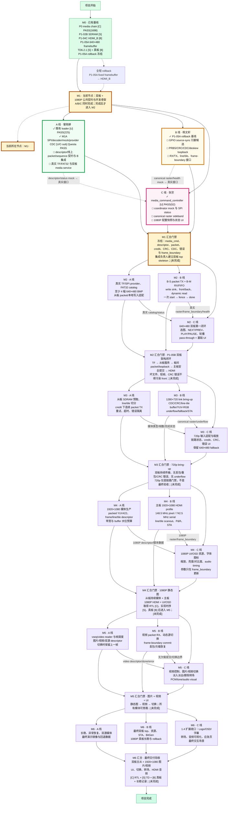

# 三线统一集成流程图

开发只使用一套节点 `M0～M6`。每个节点先分成 A/B/C 三条任务，再在同一个节点汇合。图中箭头从项目开始指向最终交付，`M1` 是当前节点。

图例：绿色 = 已完成；黄色 = 当前节点/当前任务；白色 = 未完成；蓝色 = 三线汇合；紫色 = 双板 + 1080P 主线；A/B/C 使用不同边框颜色；实线 = 必须完成的真实依赖；点划线 = 可先用 mock、随后必须替换为真实接口的依赖；虚线 = rollback/fallback。C 线的 A/B 依赖专门画在每个节点旁，避免把“可独立写代码”误读成“可以脱离 A/B 完成验收”。

```mermaid
flowchart TD
    START["项目开始"] --> M0["M0 · 已有基线<br/>P0 media chain [C] PASS(1698)<br/>P1-02B SDRAM [S]<br/>P1-04C HDMI_B [B]<br/>P1-05A 640×480 framebuffer<br/>TD6.2.1 [S] + 真板 [B]<br/>P1-05A rollback 冻结"]

    M0 --> M1G["M1 · 当前节点：双板 + 1080P 公共契约与开发骨架<br/>A/B/C 同时完成；完成后才进入 M2"]
    M1G -.-> CUR["当前所在节点：M1↑"]
    M1G --> M1A["A 线 · 曾雨婷<br/>✓ 既有 loader [U] PASS(225)<br/>✓ M1A SPI/decoder/mock/provider CDC [U/C-sub] Questa PASS<br/>□ descriptor/线上 packet/sequence 契约与 B 集成<br/>□ 真实 TF/FAT32 与双板 media service"]
    M1G --> M1B["B 线 · 杨文轩<br/>✓ P1-05A rollback 基线<br/>□ GPIO source-sync 引脚候选<br/>□ PRBS/CRC/CDC/deskew loopback<br/>□ RX/TX、line/tile、frame-boundary 接口"]
    M1G --> M1C["C 线 · 张宗<br/>✓ media_command_controller [U] PASS(52)<br/>□ coordinator mock 与 SPI status<br/>□ canonical raster sideband<br/>□ 1080P 配置快照与状态 UI"]
    M1A -.->|descriptor/status mock → 真实接口| M1C
    M1B -.->|canonical raster/health mock → 真实接口| M1C
    M1A --> M1E["M1 汇合门禁<br/>冻结：media_cmd、descriptor、packet、credit、CRC、CDC、错误与 frame_boundary<br/>集成负责人建立双板 top skeleton；[未完成]"]
    M1B --> M1E
    M1C --> M1E

    M1E --> M2A["M2 · A 线<br/>真实 TF/SPI provider、FAT32 catalog<br/>至少 4 幅 640×480 BMP<br/>从板 packet/本地写入适配"]
    M1E --> M2B["M2 · B 线<br/>B-S packet TX + B-M RX/FIFO<br/>write sink、front/back、dynamic read<br/>一次 start → fence → done"]
    M1E --> M2C["M2 · C 线<br/>640×480 双板第一闭环<br/>选图、NEXT/PREV、PLAY/PAUSE、轮播<br/>pass-through + 基础 UI"]
    M2A --> M2E["M2 汇合门禁 · P1-05B 双板架构闭环<br/>TF → 从板服务 → 板间 packet/loopback → 主板安全提交 → HDMI<br/>坏文件、短帧、CRC 错误不得污染 front；[未完成]"]
    M2B --> M2E
    M2C --> M2E
    M2A -->|真实 catalog/status| M2C
    M2B -->|真实 raster/frame_boundary/health| M2C

    M2E --> M3A["M3 · A 线<br/>从板 SDRAM 预取、line/tile 切分<br/>credit 下连续 packet TX<br/>重试、超时、错误隔离"]
    M2E --> M3B["M3 · B 线<br/>1280×720 link bring-up<br/>CDC/CRC/line-tile buffer/YUV-RGB<br/>underflow/fallback/STA"]
    M2E --> M3C["M3 · C 线<br/>720p 输入适配与缩放<br/>链路状态、credit、CRC、错误 UI<br/>保留 640×480 fallback"]
    M3A --> M3E["M3 汇合门禁 · 720p bring-up<br/>双板持续传输、无丢包/重包/CRC 错误、无 underflow<br/>720p 仅是链路门禁，不是最终验收；[未完成]"]
    M3B --> M3E
    M3C --> M3E
    M3A -->|媒体类型/帧数/完成状态| M3C
    M3B -->|canonical raster/underflow| M3C

    M3E --> M4A["M4 · A 线<br/>1920×1080 媒体生产<br/>packed YUV422、frame/line/tile descriptor<br/>带宽与 buffer 水位预算"]
    M3E --> M4B["M4 · B 线<br/>主板 1920×1080 HDMI profile<br/>148.5 MHz pixel / 742.5 MHz serial<br/>line/tile scanout、P&R、STA"]
    M3E --> M4C["M4 · C 线<br/>1080P UI/OSD 资源、字体图标<br/>缩放、亮度/对比度、audio timing<br/>参数只在 frame_boundary 更新"]
    M4A --> M4E["M4 汇合门禁 · 1080P 静态图<br/>从板持续媒体 + 主板 1080P HDMI + UI/OSD<br/>取得 RTL [C]、实现时序 [S]、真板 [B] 后进入 M5；[未完成]"]
    M4B --> M4E
    M4C --> M4E
    M4A -->|1080P descriptor/媒体数据| M4C
    M4B -->|1080P raster/frame_boundary| M4C

    M4E --> M5A["M5 · A 线<br/>vseq/video reader 与帧调度<br/>图片/视频/双源 descriptor<br/>切换时保留上一帧"]
    M4E --> M5B["M5 · B 线<br/>视频 packet RX、动态源切换<br/>frame-boundary commit<br/>丢包/欠载恢复"]
    M4E --> M5C["M5 · C 线<br/>视频控制、图片/视频切换<br/>淡入淡出/擦除转场<br/>PCM/tone/audio visual"]
    M5A --> M5E["M5 汇合门禁 · 图片 + 视频 + UI<br/>静态图 → 视频 → 切换；所有模块可旁路；[未完成]"]
    M5B --> M5E
    M5C --> M5E
    M5A -->|video descriptor/done/error| M5C
    M5B -->|无欠载提交/切换边界| M5C

    M5E --> M6A["M6 · A 线<br/>长稳、异常恢复、双源媒体<br/>最终演示镜像与回退数据"]
    M5E --> M6B["M6 · B 线<br/>最终双板 top、资源、STA、BitGen<br/>1080P 真板长稳与 rollback"]
    M5E --> M6C["M6 · C 线<br/>1.4 扩展收口：Logo/OSD/字幕<br/>转场、音频可视化、应急页<br/>最终交互场景"]
    M6A --> M6E["M6 汇合 · 最终交付验收<br/>双板主从 + 1920×1080 图片/视频<br/>UI、切换、转场、HDMI 音频<br/>[C] RTL + [S] TD + [B] 真板 + 长稳记录；[未完成]"]
    M6B --> M6E
    M6C --> M6E
    M6E --> DONE["项目完成"]

    M0 -.-> RB["全程 rollback<br/>P1-05A fixed framebuffer → HDMI_B"]
    RB -.-> M1G

    classDef done fill:#dcfce7,stroke:#16a34a,color:#111;
    classDef current fill:#fff3cd,stroke:#b45309,color:#111,stroke-width:4px;
    classDef pending fill:#ffffff,stroke:#6b7280,color:#111;
    classDef merge fill:#dbeafe,stroke:#2563eb,color:#111;
    classDef laneA fill:#f0fdf4,stroke:#16a34a,color:#111;
    classDef laneB fill:#fffbeb,stroke:#d97706,color:#111;
    classDef laneC fill:#fdf2f8,stroke:#db2777,color:#111;
    classDef mainline fill:#ede9fe,stroke:#7c3aed,color:#111;
    classDef endpoint fill:#d1fae5,stroke:#059669,color:#111;

    class START,M0 done;
    class M1G,M1A,M1B,M1C,M1E,CUR current;
    class M2A,M2B,M2C,M3A,M3B,M3C,M4A,M4B,M4C,M5A,M5B,M5C,M6A,M6B,M6C pending;
    class M2E,M3E,M4E,M5E,M6E merge;
    class M1A,M2A,M3A,M4A,M5A,M6A laneA;
    class M1B,M2B,M3B,M4B,M5B,M6B laneB;
    class M1C,M2C,M3C,M4C,M5C,M6C laneC;
    class M2A,M2B,M2C,M2E,M3A,M3B,M3C,M3E,M4A,M4B,M4C,M4E,M5A,M5B,M5C,M5E,M6A,M6B,M6C,M6E mainline;
    class DONE endpoint;
```
