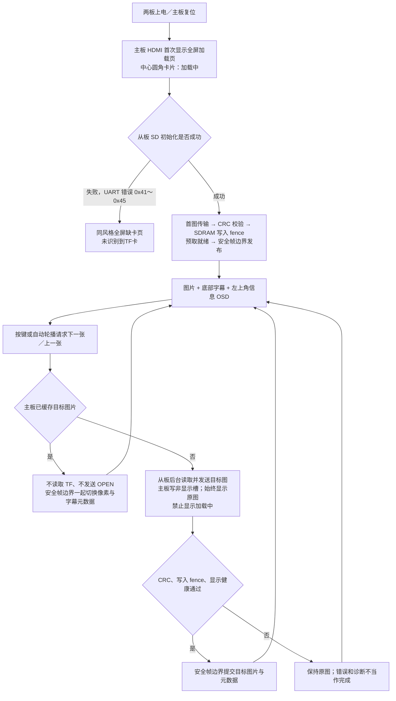

# M2.1 · UI 与快切工程集成（2026-10-06）

状态权威仍为 [`../03_plan_and_status.md`](../03_plan_and_status.md)。本记录对应 `M2_UI_FAST_INTEGRATION_20261006`，不是旧 FIX6 的真板证据。当前输出为 **640×480**，最终 1080P 目标继续按 M3 推进。

## 1. 集成来源与工作边界

- 正式工程基点：`eea702eac57f0ca220378bfad28d09602a2ccbff`；集成分支：`fix/m2-fast-ui-20261006`。
- UI 来源：`D:/AnlogicProject/FPGA_TEST/5_loading_overlay_subtitle_top_left_rgb_info_rounded_full_sim`。
- 快切来源：`D:/AnlogicProject/FPGA_TEST/FPGA_Competition_HDMI_timing_fastfix/FPGA_Competition_HDMI_timing_fastfix`，注意内部还有同名目录。
- 选择性合入共享 RTL、接口和测试；保留正式工程原有文档修改及 GUI `_Runs`；继续使用两个 active `.al`，不复制厂商加密 IP。
- 保留 UI 工程的底部字幕、左上角圆角半透明 RES/RGB 信息框和 CRC 覆盖的文件名/尺寸传输。按本次需求，取消后续切图的中心 Loading 浮窗。
- 采用快切工程的运行期 SD 提速、缩短 STATUS 等待和后台缓存思路；统一手动/自动命令入口，扩展为六槽缓存，缓存内容包括像素和对应字幕元数据。跨域请求/回复使用正式 FIFO 的 FWFT 握手语义。

## 2. 本候选的显示契约



`DISPLAY_PUBLISHED` 仍是当前远程传输完成后的实际显示证明，要求 fence、像素输出和 HDMI 健康均成立；它不能被简单改成“屏幕上还有旧图”。本地缓存命令只在帧边界完成后回复成功，缓存未命中仍必须等待 Slave 的真实 DONE。

缺卡提示依据从板 SD 命令阶段错误推断，没有增加物理卡检测管脚。FAT/BMP 内容错误、CRC 错误和 UART 超时不直接标成缺卡。换卡或更改卡内文件后，应双板复位，使目录与图片缓存重新建立；本次不宣称热插拔及全故障恢复已验收。

## 3. 提速与缓存接口

| 项目 | 本次实现 | 证据和边界 |
|---|---|---|
| 主板缓存 | 六张 640×480 RGB888 图，每像素占一个 32-bit SDRAM word | 基址 `0/307200/614400/921600/1228800/1536000`，最高有效地址 `1843199`，不超过 2M×32 容量 |
| 槽分配 | 优先空槽；满时选择显示槽之外的下一槽，开始重写即失效 | 显示槽不被后台加载覆盖；CRC/fence/帧提交之前不能命中正在加载的槽 |
| 字幕一致性 | 按槽缓存 id、8.3 文件名、width/height/bpp | 本地换图与正常远程换图均按同一安全帧边界提交元数据 |
| 缓存命中 | 手动与自动轮播共用命令路由器；不发 UART OPEN | 正式显示核心仿真两次测得 `16,799,980 ns`，约 16.8 ms；安全切换预算不超过两帧，另有按键消抖时间 |
| SD 运行期 SPI | `SPI_CLK_DIV: 4 → 0`，初始化仍用 32 | 复用官方 SPI 引擎；25 MHz 域实际 SCLK 为 **3.125 → 6.25 MHz**，不是 25 MHz；板测待验 |
| 图片传输 | `COMPACT_RGB888=1`，连续地址只发送 RGB word，地址跳变才补 ADDR | 含 NAME/INFO 的 640×480 bottom-up BMP：`614410 → 307690` words，减少约 49.9% 的传输字数 |
| 控制等待 | STATUS poll gap `1000000 → 50000` 个 50 MHz clocks | 等待间隔 20 ms → 1 ms，实际轮询仍包含 UART 帧传输时间 |

缓存命中才接近瞬间切换；**首次访问、缓存未命中、双板复位后仍要读取/传输**，期间保持旧图。第一次轮播会逐步填充缓存；超过六张的目录存在淘汰。本节描述的是 UI 快切基础候选；随后加入的后台预测预读、预读完成粘滞反馈和用户优先级见 [`M2_PREFETCH_20261006.md`](M2_PREFETCH_20261006.md)，不改变本节的 640×480 容量边界，也未宣称冷加载的真板耗时已经达到某个数值。

此六槽布局仅适用于当前 640×480 profile，**不得直接套到 1080P**。M3 必须重新冻结像素打包、存储布局、缓存数量和 raster/font 坐标宽度。

### 板间协议变更

- 旧 header `B17E00xx`：每个像素 `ADDR + PIXEL`，保持兼容接收。
- 新 header `B17E01xx`：地址从零开始，RGB word 的高八位为零，接收后地址自增；不连续地址仍发送原 ADDR word。
- bottom-up BMP 每行地址跳转，因此每行保留一个 ADDR。
- 文件名和尺寸使用原 NAME/INFO 尾部扩展，CRC 覆盖所有实际传输字；CRC 正确后才能发布元数据。
- **Master 与 Slave 必须成套升级**；旧 Master 不识别新 compact header。14 根线和 FIX6 的 ADC 球位映射不变。

## 4. UI 时序修复

UI 来源工程的真实 routed 最差 setup 为 **−31.562 ns**，像素域的组合路径包含可变十进制除法，共 75 级逻辑。

本次将尺寸/BPP 格式化移出逐像素组合路径，采用 16 拍 shift-add-3 BCD，字符输出只选择寄存器中的数字；圆角距离计算限制到实际小半径位宽。元数据在帧边界更新，格式化在左上角文字到达之前完成，没有通过隐藏像素域路径来消除违例。

同时修正 framebuffer 数据与官方已寄存 AXIS 的一拍差异，验证整帧 307200 个像素，包括每行最后一个像素。50 MHz 控制与 25 MHz 像素域通过请求/回复 FIFO 和缺卡/HDMI 状态同步器通信；Master SDC 新增相应跨域 clock group，OSD 同域路径继续完整计时。

最终 release 的 TD6.2.1 synthesis、P&R、final STA、BitGen：

| 角色 | LUT | REG | BRAM9K | SWNS | STNS | HWNS | HTNS |
|---|---:|---:|---:|---:|---:|---:|---:|
| Master | 8730 | 4716 | 16 | +0.190 ns | 0 | +0.011 ns | 0 |
| Slave | 7058 | 5837 | 0 | +10.203 ns | 0 | +0.075 ns | 0 |

这是对应候选 routed 实现的无违例结果，Master 时序裕量仍较小，不代表 1080P 时序已闭合。厂商 PLL/APUG011/APUG092/PHY 保持原源码。

## 5. 可复现检查

```powershell
python tools/check_td_project.py
python tools/check_m2_b_line.py
python tools/run_m2_control_regression.py
python tools/run_m2_loading_info_regression.py --suite extended
python tools/run_m2_ui_fast_e2e.py
python tools/build_m2_roles.py --output sim_work/m2_ui_fast_20261006_release
```

- 原有控制/媒体/传输 14 项回归 PASS。
- UI/文件名/尺寸/六槽元数据/缓存 CDC/compact CRC/bottom-up/像素对齐等扩展回归 **28/28 PASS**。
- 补充集成 **4/4 PASS**：手动与自动缓存控制、缓存未命中避免跳过 Slave 同 id 的 OPEN、UART 缺卡分类与恢复、真实 SD 无卡超时/重扫、正式显示核心启动/三槽换图/缓存元数据/全帧对齐（四个 testbench 内分别包含多个场景）。
- `tb_p1_sdram_cached_adapter` 定向回归 PASS(58)。未重新执行全仓 full audit，不能据此宣称所有历史/可选测试全绿。
- `m2_display_vendor_models.v` 仅替代仿真中的 PLL/SDRAM/HDMI 物理边界，正式工程不加载它；Questa 证明 RTL 显示行为，TD 证明 routed 时序，真板 HDMI/TF 性能仍须单独取证。

原始证据均在 `evidence/M2_UI_FAST_INTEGRATION_20261006_*`：两份 final timing/area/build、四份集成日志、回归 CSV 和完整 source/bit 哈希 manifest。

RTL 像素生成的页面预览：


## 6. 成套烧录与板测

交付目录：`sim_work/m2_ui_fast_20261006_release/delivery/`。

| 文件 | 对应角色 | SHA256 |
|---|---|---|
| `master.bit` | `m2_master_tf_hdmi_top`，主板 HDMI/按键/缓存/UI | `cfb27479e3f7872a3ae9ffe82d62c878f4393a76f7f6273948d85989d0594dc1` |
| `slave.bit` | `m2_slave_media_tx_top`，从板 TF/文件/发送 | `ab78c2e6d03b085d9ccb33b0d3418b18216e7d9be508cdad473617fb25007cbf` |

沿用 FIX6 14 线接线，HDMI 接 Master，TF 放 Slave。尤其保持 J1-5/H13、J1-6/H14、J1-7/J14 的正确映射；不要使用早期错误球位表。

1. 成套烧录，使用已通过的 FAT32 TF 卡和 640×480、24-bit BI_RGB BMP。两板重新上电：加载页 → 第一张图 → 正确字幕和左上角信息；记录开机至首图时间。
2. KEY2/NEXT、KEY3/PREV、KEY4/PLAY-PAUSE：第一次访问未缓存图片时原图始终可见，无绿屏、无 Loading 浮窗、无半帧。记录首次切图时间。
3. 让四张图完整显示一轮，再暂停轮播手动 NEXT/PREV；应明显快于首次访问，图片与文件名同步。再开启轮播确认同样走缓存快切；记录命中切图时间。
4. 断电后取出 TF，再给两板上电：先加载页，随后显示“未识别到TF卡”。重新插卡并双板复位验证首图重建。
5. 补测快速连按、超过六张的缓存淘汰、损坏 BMP、单板复位、链路断线及长稳。按候选名记录板号、bit 哈希、LED/现象；通过后只在 docs03 升级 `[B]/[L]`。

**本候选 `[B]/[L]` 待用户上板，旧 FIX6 `[B]` 保留为回退基线。**

## 7. 后续三线维护边界

| 线 | 负责模块和接口 |
|---|---|
| A／曾雨婷 | `fat32_scan`、catalog、`m2_real_media_service`、TF sector/SPI；filename/descriptor/SD 错误阶段；实测 TF/解码耗时 |
| B／杨文轩 | `m2_remote_frame` compact+CRC、mailbox 背压、SDRAM/预取/安全换槽；六槽容量与 fence；1080P profile 重规划 |
| C／张宗 | `m2_image_info_overlay`、`m2_image_subtitle`、`m2_loading_card`、字幕按槽恢复、命令路由/CDC；禁止重载 Loading 的显示契约 |
| 集成／张宗 | 两角色 Top、公共缓存/字幕/协议契约、ADC/SDC、TD 工程、成套 bitstream、证据与真板收口 |

本次共享接口已经在同一个候选中同步修改。后续若修改 header、像素格式、槽数或 frame commit，需要 A/B/C 与两份 Top 同步验收，避免单边升级。
